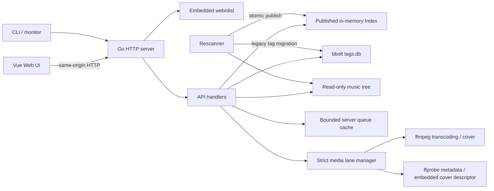
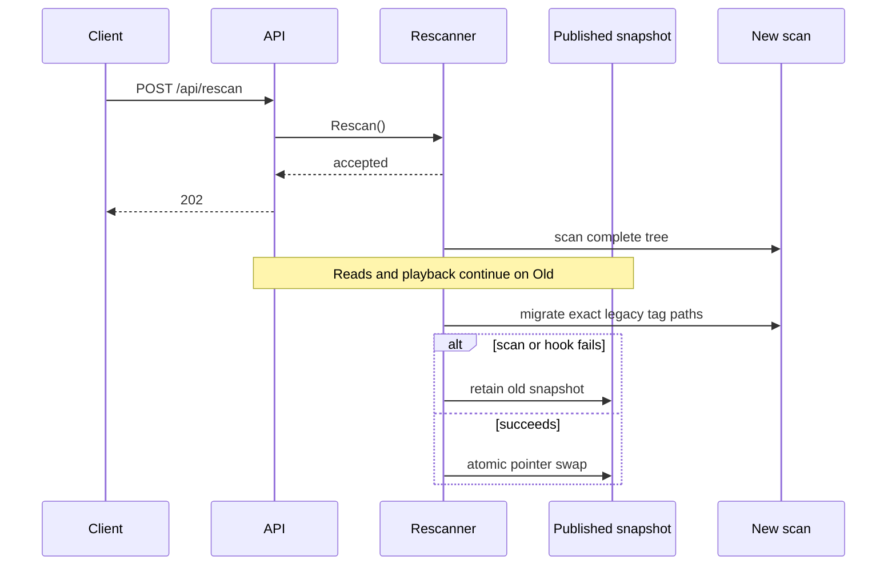

# 架构说明

ShuffleMuse 采用单进程、单二进制、内存曲库快照和独立标签持久化的设计。目标是让部署简单，同时保证后续重扫和媒体处理不会破坏正在进行的播放。

## 系统边界



生产构建先由 Bun 生成 SPA，再由 Go `//go:embed` 把 `web/dist` 编入二进制。运行时不需要 Node、Bun、nginx 或独立静态文件目录。

## 代码目录职责

| 路径 | 职责 |
| --- | --- |
| `cmd/server` | 配置、依赖装配、HTTP/SPА 路由、信号与关机顺序 |
| `internal/config` | 环境变量加载、CIDR 解析和启动校验 |
| `internal/api` | 路由、请求边界、认证 gate、安全中间件和响应契约 |
| `internal/auth` | 单密码 Session、直连白名单、真实 IP 和登录封禁 |
| `internal/index` | 文件扫描、相对路径 ID、原子快照和重扫生命周期 |
| `internal/tags` | bbolt 双向标签关系、Graveyard 和旧路径迁移 |
| `internal/mediaexec` | FFmpeg/ffprobe 共享并发与等待队列 |
| `internal/playqueue` | 随机排列、共享快照、TTL/LRU/字节预算和队列令牌 |
| `internal/stream` | 原文件、Opus 转码、metadata 和媒体 MIME |
| `internal/cover` | 内嵌封面和同目录 fallback |
| `web/src` | Vue 页面、组件、Pinia 状态和 API client |

## 启动生命周期

1. `config.Load` 读取环境，`Validate` 校验范围和结构。
2. 分别检查 `ffmpeg` 和 `ffprobe` 是否位于 `PATH`；缺失时打印对应功能会失败的 warning，但不阻止原文件播放服务启动。
3. 创建 bbolt 父目录并打开标签库。
4. 解析认证白名单和可信代理网段。
5. 创建严格媒体分舱 Manager、stream router、Session 管理器、队列缓存和 API。
6. 创建没有初始快照的 Rescanner，并安装发布前标签迁移 hook。
7. 启动 HTTP listener。
8. 异步启动首次扫描。

先监听再扫描使状态和 readiness 在大型曲库初始化期间可见。代价是首次成功前所有曲库数据 API 都返回 `503 LIBRARY_SCANNING`。

## HTTP 服务与 SPA

Go `ServeMux` 将：

- `/api/` 交给带认证和安全中间件的 API；
- `/` 交给嵌入式文件服务；无扩展名的导航路径不存在时回退 `index.html`，支持 Vue history 路由；缺失的 `/assets/*` 或带扩展名文件保持 404。
- Vite 内容哈希资源使用 `public, max-age=31536000, immutable`，HTML/导航响应使用 `no-cache`。

HTTP 超时：

| 设置 | 值 | 原因 |
| --- | ---: | --- |
| ReadTimeout | 15 秒 | 限制慢请求头/body |
| WriteTimeout | 0 | 不为长时间音频流设置固定上限 |
| IdleTimeout | 60 秒 | 回收空闲 keep-alive |

API 和 SPA 都应用 Host 校验及相同安全响应头。

## 扫描与内存索引

### 扫描内容

扫描器使用 `filepath.WalkDir`，只读取目录项，不在建索引时运行 ffprobe 或读取音频 metadata。它接受支持扩展名的普通文件，并跳过：

- 点文件和点目录；
- 非普通文件；
- 最终目标位于音乐根外的符号链接。

库内符号链接可索引。损坏符号链接、权限错误或遍历错误会使整次扫描失败；扫描不是“尽可能跳过所有错误”的模式。

### FileEntry 与稳定 ID

每个条目只包含：

- `Filepath`：相对音乐根路径；
- `Name`：不含最后扩展名的文件名；
- `Dir`：相对目录；
- `ID`：清理后的相对路径 SHA-256 前 16 字节的 Base64URL。

ID 对同一路径稳定，但移动、重命名或改变路径规范会生成新 ID。数据库保存路径而不是 ID，所以同一路径恢复时标签可重新关联。

### 路径安全

扫描外的读取使用 `ResolveWithinRoot`：

1. 计算并解析音乐根真实路径；
2. 在解析候选符号链接前检查词法范围；
3. 解析候选符号链接；
4. 再检查最终目标仍在根目录。

Browse 还拒绝绝对路径、`..` 逃逸、隐藏路径组件和系统杂项名称。

## Rescanner 与 generation

Rescanner 持有一个 `atomic.Pointer[Index]`。每次扫描在独立对象中完成，只有全部成功并通过发布前 hook 后才原子替换当前指针。



生命周期不变量：

- 初始状态为 `initializing`、generation 0、未就绪；
- 首次成功发布 generation 1；
- 后续重扫时旧快照继续服务，readiness 保持成功；
- 失败或取消从不替换最后成功快照；
- generation 仅在路径集合变化时递增，顺序、mtime、内容和 metadata 变化不递增；
- 每次成功扫描都会更新 `LastScan`；
- 同时只允许一次扫描，额外手动请求不排队；
- 首次扫描失败后定时器不会自动重试，需要手动 Rescan；`MUSIC_RESCAN_INTERVAL=0`（默认）不创建周期定时器，正数配置才会在已有成功快照后运行周期重扫。

单个数据请求通过中间件捕获一次 `Index + generation`，后续 handler 不重新读取，避免一次响应混用两个快照。依赖“检查在线状态并修改标签”的 Graveyard 删除使用发布读锁完成检查和事务。

## 随机播放队列

新队列从系统熵分别读取 32 字节洗牌种子与 32 字节令牌。种子初始化 `math/rand/v2.ChaCha8`，再对候选 `[]uint32` 执行 Fisher–Yates；令牌以 Base64URL 发给客户端，服务端只以 SHA-256 摘要作为 map key。两者不互相派生。

同 generation 的队列引用同一只读 `Index`，不复制 `Files` 或 `ByID`。
标签候选和 pin 只影响 `uint32` 顺序及小型前缀覆盖；带标签的队列只接受
同样属于该标签的 pin，避免标签外曲目混入。容量核算把不同快照只计一次；
旧 generation 在最后一个队列释放后可回收。队列排列不可变，固定 200 条
分页只做切片。选取任意歌曲时的线性位置扫描在全局 Manager 锁外执行并
响应 request cancellation；重新加锁后必须校验原队列身份，才返回页面或
原子替换队列。

重扫发布不修改队列：页面 materialize 时用当前 Index 检查 ID/路径，删除项显示 `available:false`，next/previous 跳过；新增项只进入下一次新建或 Randomize。TTL/LRU 淘汰后前端最多自动恢复一次，以相同标签和当前歌曲 pin 创建新队列，同时保留正在播放的 Audio source。

## 标签持久化模型

标签数据库是唯一应用持久化状态，使用 bbolt `0600` 文件和两个 bucket：

```text
files: filepath -> JSON [tag, ...]
tags:  tag      -> JSON [filepath, ...]
```

添加、删除和 Graveyard 清理都在一个 bbolt 写事务中维护正向与反向关系。双向结构让“读取文件标签”和“列出某标签文件”都不需要全库扫描。

### 在线状态与 Graveyard

数据库不保存 online/offline flag。状态在请求时由“数据库路径是否出现在当前 Index”派生：

- Tags 标签云只统计 online；
- tag 文件列表只返回 online；
- `数据库路径 - 当前路径集合` 构成 Graveyard；
- 文件以同一路径恢复后自然重新 online，标签无需迁移；
- 删除 Graveyard 记录只删除双向标签关系，不访问或删除磁盘文件。

### 旧路径迁移

若设置 `MUSIC_LEGACY_MUSIC_ROOT`，成功扫描发布前会把明确位于该根内、且转换后路径真实出现在新 Index 中的旧绝对 key 转为相对路径。目标已有标签时合并去重。无法精确证明的记录保留到 Graveyard，不执行任意后缀匹配。

## 媒体管线

### 原文件

Original 使用 `http.ServeContent`：

- 支持 HEAD、Range、条件请求；
- 不启动 FFmpeg；
- 不占媒体并发；
- 音频响应 `Cache-Control: private, no-store`。

### Opus 转码

转码按请求启动 FFmpeg：

- 可选 `-ss` 从目标秒数开始；
- 只映射第一音轨；
- 去除视频和封面流；
- libopus、配置码率、VBR、Ogg 输出到 HTTP；
- request context 取消会终止子进程；
- HEAD 只设置预期响应头，不启动 FFmpeg。

在输出提交前的错误可转为 JSON；输出已开始后只能终止连接并记录日志。

### 严格媒体分舱

总进程数始终受 `MUSIC_FFMPEG_MAX_SESSIONS` 硬限制。默认把 2 个槽分成不互借的两个 lane：

- 转码 lane：最多 1 个长 Opus；
- 辅助 lane：最多 1 个 metadata、cover descriptor 或 cover render。

两个 lane 有独立等待队列。辅助任务中 metadata/descriptor 为高优先级，连续最多 4 个后若封面转换等待则让出一次。同一文件身份的 metadata 与内嵌封面 descriptor 合并为一次 ffprobe，并在 Acquire 前共享 singleflight；Manager 统一追踪 active task、取消和关机 WaitGroup。总数为 1 且未显式设置辅助保留时使用旧共享模式。

### Metadata LRU

共享 probe 一次读取 TITLE、第一音轨 codec/bitrate/duration 与第一视频流尺寸，stdout 上限 64 KiB。缓存键包含绝对路径、大小和 mtime，成功 LRU 固定默认 4096 条；确定性命令或 JSON 失败进入有界 30 秒负缓存，busy、deadline、取消和临时 I/O 不缓存。音频 metadata 与封面尺寸分别校验，任一部分无效不隐藏另一部分。底层任务使用独立 deadline；单个 waiter 取消不影响其他 waiter，全部离开才取消底层任务。

### 封面

Loader 按 `cover.jpg` → `cover.png` → `folder.jpg` → `folder.png` 寻找同目录、大小写不敏感的外置封面，不存在时才消费共享 probe 已发现的内嵌封面 descriptor。查找不递归，也不扩展到其他文件格式。外置源超过 20 MiB、8192 单边或 40 MP 时稳定返回 not-found；超过 1536 单边或 1 MiB 才进入 `AuxRender`。FFmpeg 单线程输出最长边 1024、不放大的 JPEG q3，PNG 和带透明度的内嵌图先合成白底。JPEG 结果只有达到 15% 节省才替代原文件。

HEAD/304 只读取 descriptor，不启动 FFmpeg。未转换外置图使用 `Open` + `ServeContent` 原样发送；转换字节只在当前请求或同一 in-flight 请求组中存在，结束后立即释放，不进入 LRU。服务端只保留小型 descriptor LRU 和 30 秒负缓存。ETag 包含源身份、阈值与编码规格，成功响应允许浏览器私有缓存 1 小时。

等待队列满或等待槽位超时映射为 `503 MEDIA_BUSY`，底层任务 deadline 映射为 `504 MEDIA_TIMEOUT`。Opus 首次成功写入最长 15 秒；之后使用 60 秒滚动 write idle deadline，不限制整首总时长。写失败或客户端断开时先取消进程，再 Wait 并释放 lane。

## 认证和请求安全

### Session

单密码使用 constant-time 比较。成功后生成随机 Token，Cookie 保存原值，服务端只保存摘要和固定过期时间。访问更新 LRU 时间但不延长 expiry。Session map 固定最多 1024 条。

### 登录 IP

登录封禁使用 `ClientIPResolver` 的结果；认证白名单始终使用 `DirectPeerIP`。这种分离防止攻击者通过伪造 XFF 取得免登录权限。

登录失败状态固定最多保留 4096 个客户端，并用 pending/blocked 两条 LRU 在同一把锁内维护 map 一致性。容量满时先清理到期封禁，再淘汰最旧的未封禁计数；若全部槽位都是有效封禁，则保留这些 ban，并对新来源的本次错误密码直接返回封禁结果而不增加 map。封禁 deadline 仍固定，后续攻击不会续期。

### 请求边界

安全中间件处理 Host、Origin、Sec-Fetch-Site 和全局响应头；handler 层处理 8 KiB 严格 JSON、分页和查询字节限制。CLI 不发送 Origin 时仍可工作。

## 前端状态架构

### Pinia stores

| Store | 主要责任 |
| --- | --- |
| `auth` | 四态认证状态机、登录/退出和显式重试 |
| `library` | 2 秒状态轮询、首次扫描、重扫和 generation |
| `player` | Audio 元素、队列描述/全局位置、最多 5 页 LRU、播放意图、模式和 metadata |
| `tags` | 标签云、当前 200 条标签文件页和 selection |

### 异步一致性

前端使用 request ID、lifecycle epoch、play epoch 和 AbortController 阻止迟到响应写回：

- 新搜索会取消旧搜索请求并使旧结果失效；
- 切换 Browse 目录会取消旧请求并立即清空旧内容；
- stop 后状态与重扫请求被取消且不能回写；
- 文本 Preview 卸载时取消仍在进行的内容请求；
- 用户显式选歌后，旧 playlist 请求不能替换它；
- 标签文件只保留当前服务端分页；播放列表页面要求同一个 generation；
- logout 和 Session 过期会统一重置播放器、曲库和标签状态。

### UI 渲染边界

- Search 每页 50 条并按 ID 去重追加；
- Browse 目录和文件合计每页 50 条；
- Playlist API/UI 每页 200 首，浏览器最多缓存 5 页；
- Tags 文件 API/UI 每页 200 条，只保留当前页。

## 关机生命周期

收到 SIGINT/SIGTERM：

1. `BeginShutdown` 先把 readiness 设为失败；
2. 创建 30 秒统一 deadline；
3. `http.Server.Shutdown` 停止接收新连接并等待现有 handler；
4. deadline 超时则 `Server.Close` 强制关闭；
5. 取消并等待 Rescanner；
6. 在同一 deadline 内等待媒体任务；
7. 关闭 bbolt。

Compose `stop_grace_period: 40s` 给内部 30 秒流程留出额外退出时间。

## 持久化与非持久化边界

| 状态 | 存储 | 重启后 |
| --- | --- | --- |
| 标签、收藏、缺失路径关系 | bbolt | 保留 |
| 音频 Index、generation、scan status | Go 内存 | 重建 |
| Session、登录失败/封禁 | Go 内存 | 清空 |
| Metadata LRU | Go 内存 | 清空 |
| 封面 descriptor/负缓存 | Go 内存 | 清空 |
| 转换封面图片 | 仅浏览器私有缓存 | 按 1 小时 max-age/浏览器策略失效 |
| 当前队列、歌曲和位置 | 浏览器运行状态 | 清空 |
| 音量、静音、模式 | 浏览器 localStorage | 保留 |

## 当前架构限制

- 单实例设计，没有跨实例 Session、标签写入协调或分布式锁；同一 `tags.db` 不应由多个服务进程同时承担应用写入。
- 没有数据库 schema 版本、CSV import、用户/角色或外部身份提供者。
- 搜索是内存线性扫描，只匹配曲名。
- Browse 每次读取目标目录以得到稳定总数，但只用有界 max-heap 保留请求所需前缀；单次最多排序前 50,000 项，目录内更深页码被拒绝。
- CSV 在内存中完整生成。
- 已认证的状态响应公开当前 Opus 码率，前端据此显示实际配置；未认证的最小状态响应不包含该值。
- 具体实现风险和测试缺口见[项目审计](PROJECT_AUDIT.md)。
